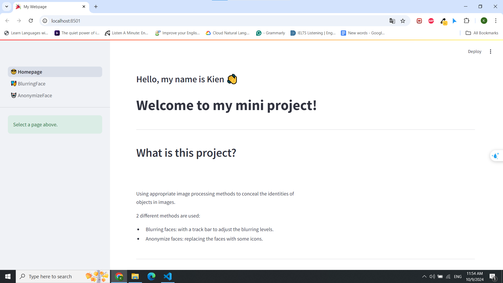

# Blur and anonymize faces online



## Features

1. Blurring faces from an image, video or webcam.
2. Anonymize faces by an icon.

## Installing

1. Create virtual environment or make sure your libraries does not conflict with some libraries in this project. 2 easy ways to create:

- Using virtual-env in python:

```
python -m venv env-name
```

- Using conda:

```
conda create -n env-name python=3.x.x
```

Python 3.9.x is recommended.

2. Installing requirements package

```
pip install -r requirements.txt
```

3. Run the web app

```
streamlit run 1_😎_Homepage.py
```

## How to use

When we set up successfully, we can access the webapp.


You can choice between two buttons or just click on the BlurringFaces and AnonymizeFace on the sidebar in the left.

1. Blurring Face:


Here you can upload your image you want to blur and adjust blurring levels trackbar which you prefer. Then click submit button and wait for the result.

You can select which type of file include: image, video, webcam on the select box on the sidebar in the left.

2. Anonymize Face:

It is similar the BlurringFace page. You can choose some icon to hide your face.


## Results

Here are some results:

<figure>

<figcaption>Origin image</figcaption>
</figure>

<figure>

<figcaption>Blur image</figcaption>
</figure>

<figure>

<figcaption>Icon face</figcaption>
</figure>
